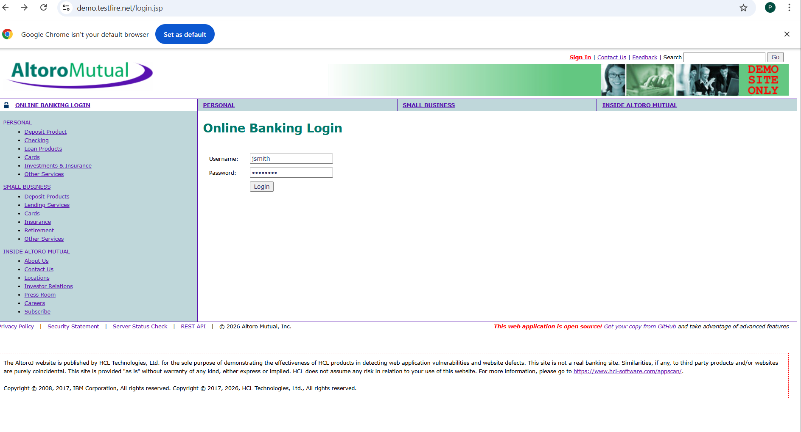
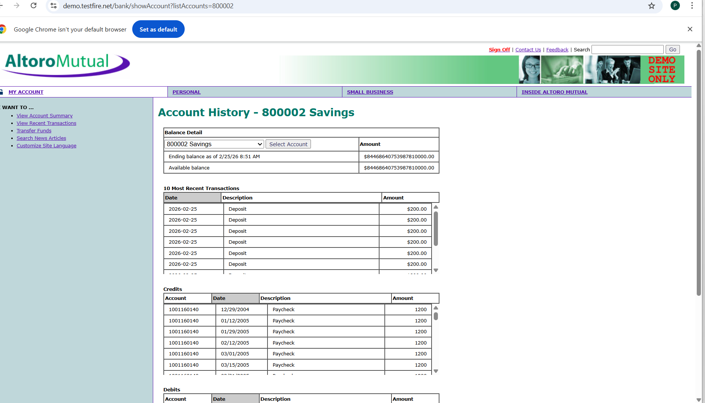
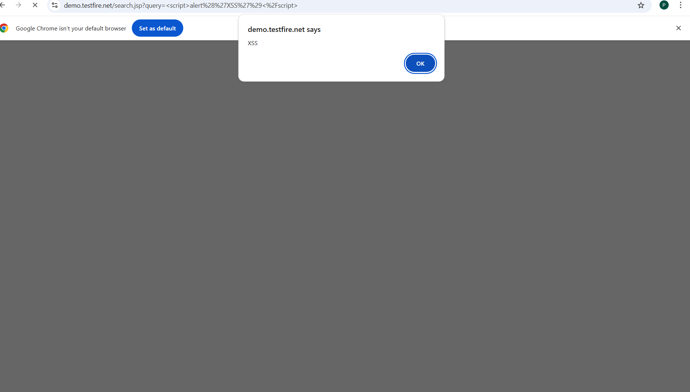
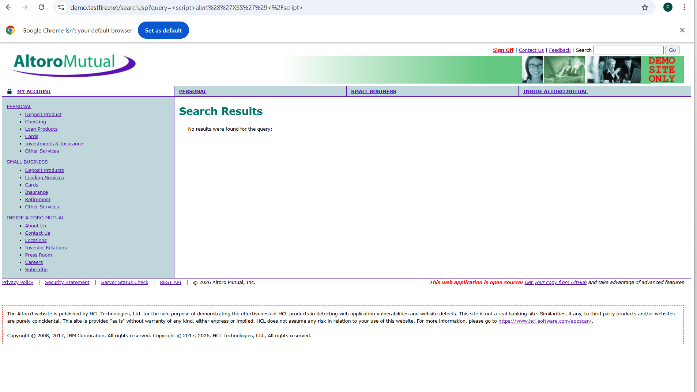

**Security-_Testing**    

"Company": CODETECH IT SOLUTIONS

"Name":GOGULAPATI LAKSHMI POORNIMA

"INTERN ID": CTIS5653

"DOMAIN": SOFTWARE TESTING

"DURATION": 4 WEEKS

"MENTOR": NEELA SANTHOSH

PROJECT TITLE: Web Application Security Testing

DESCRIPTION: This project focuses on conducting basic security testing on a sample web application to identify common vulnerabilities such as SQL Injection and Cross-Site Scripting (XSS).

The testing was performed on an intentionally vulnerable demo web application for learning and ethical testing purposes.

OBJECTIVE:

1.Identify security vulnerabilities in a web application.       
2.Understand common web security risks.        
3.Document findings and mitigation strategies.       
TESTED APPLICATION: https://demo.testfire.net/       

TESTING TYPE: Manual Security Testing.

VULNERABILITIES TESTED:

1.SQL Injection           
2.Cross-Site Scripting (XSS)        

TOOLS USED:

1.Web Browser (Google Chrome)         
2.Visual Studio Code (for documentation)        

DELIVERABLES:

README.md          
SECURITY_TESTING_REPORT.txt          
SQLinjectiontest.png               
SQLtesting_vulnerable.png                    
XSStest.png                    
XSSresults.png                      

------------------------------------------------------------

Test Case 2: Account Summary and Transaction History  

Description: After successful login, account summary and transaction history pages were accessed.  

Result: Account details and transaction history displayed correctly.  

Screenshot:  

------------------------------------------------------------

Test Case 3: Cross-Site Scripting (XSS) Testing  

Description: XSS vulnerability was tested by entering a script payload into the input field.  

Test Payload:  
  

Result: Alert popup appeared successfully.  

Status: Vulnerable  

Screenshot:  
  

------------------------------------------------------------

Conclusion: The application login and account access features are functioning properly. However, the application is vulnerable to Cross-Site Scripting (XSS). Proper input validation and output encoding should be implemented to enhance security.

